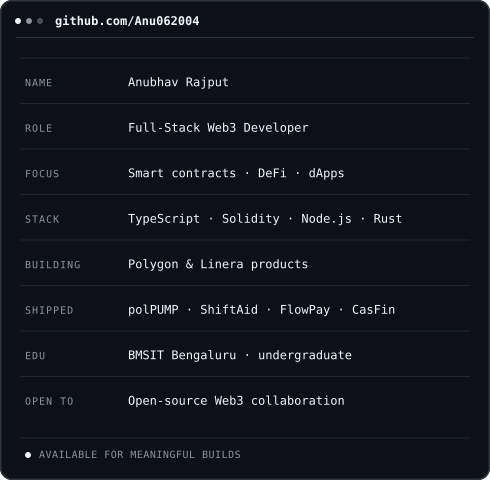

<h1 align="center">Anubhav Rajput</h1>

<code>Full-Stack Web3 Developer · Smart Contract Engineer · DeFi Builder</code>

  <a href="https://www.linkedin.com/in/anubhav-rajput-809b8521a/">LinkedIn</a> ·
  <a href="https://x.com/Anubhav06_2004">X</a> ·
  <a href="mailto:anubhavrajput572@gmail.com">Email</a>

| ASCII portrait | Profile signal |
| :---: | :---: |
|  |  |

  

  
  

  

  <picture>
    <source media="(prefers-color-scheme: dark)" srcset="https://raw.githubusercontent.com/Anu062004/Anu062004/output/github-contribution-grid-snake-dark.svg" />
    <source media="(prefers-color-scheme: light)" srcset="https://raw.githubusercontent.com/Anu062004/Anu062004/output/github-contribution-grid-snake.svg" />
    
  </picture>

Building useful systems, one deliberate commit at a time.

